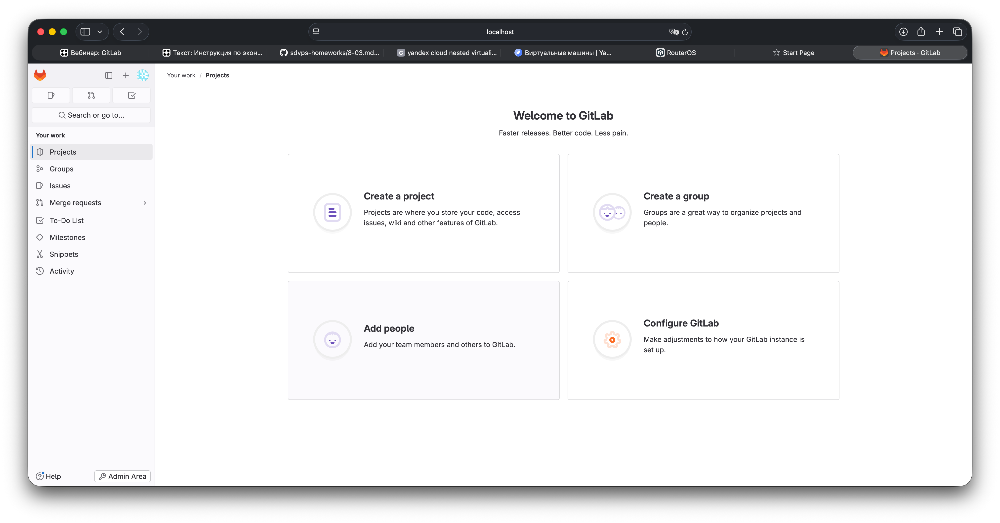
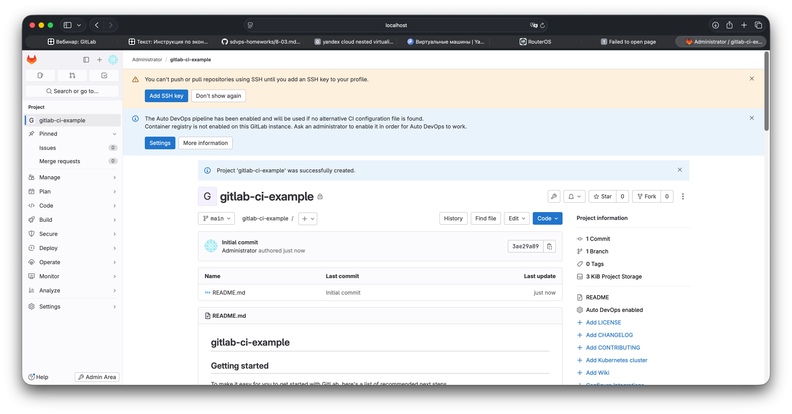
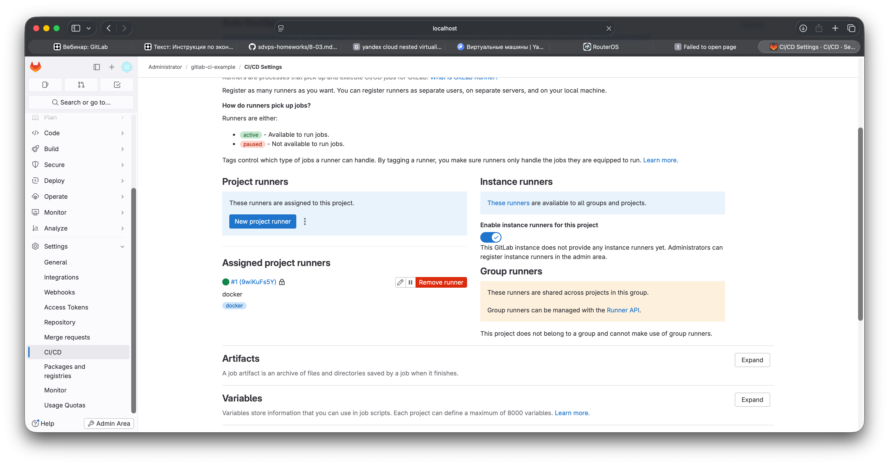
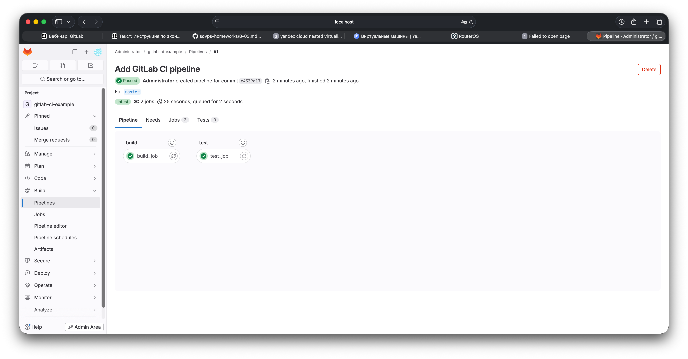
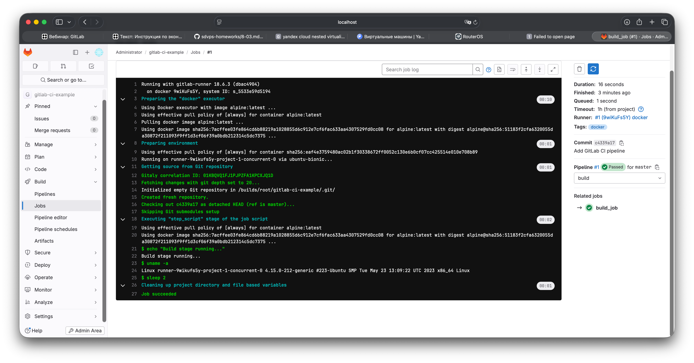

# Домашнее задание к занятию "GitLab" - Egor K

### Задание 1

### 1. Развёрнут GitLab через Vagrant

Скриншот:  


### 2. Создан проект в GitLab



### 3. Зарегистрирован GitLab Runner в режиме Docker



---

### Задание 2

### 1. .gitlab-ci.yml

```yaml
stages:
  - build
  - test

build_job:
  stage: build
  tags:
    - docker
  image: alpine:latest
  script:
    - echo "Build OK"
    - sleep 2

test_job:
  stage: test
  tags:
    - docker
  image: alpine:latest
  script:
    - echo "Test OK"
    - sleep 2
```

### 2. Список успешно выполненных pipeline’ов



### 3. Лог выполнения job в GitLab CI

